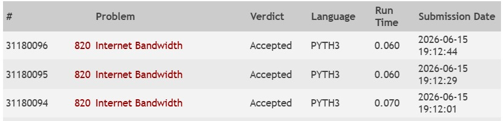

# Fluxo Máximo com Edmonds-Karp

Projeto em Python que calcula o fluxo máximo entre uma origem e um destino em uma rede com capacidades bidirecionais.

**Apresentação no YouTube:** [clicar aqui](https://www.youtube.com/watch?v=INSIRA_O_LINK_AQUI)

## Problema

- **Grupo:** G
- **Nome:** UVA 820 - Internet Bandwidth
- **Link:** https://onlinejudge.org/external/8/820.pdf

## Integrantes do grupo

- Caio Pacely
- Catarina Garcia
- Paulo de Tarso Neto

## Linguagem utilizada

- Python 3

## Estrutura do repositório

```text
trabalho-fluxo-maximo/
├── README.md
├── src/
│   └── main.py
├── dados/
│   └── entrada.txt
├── evidencias/
│   └── accepted.jpeg
└── acompanhamento/
```

## Como executar

### Windows PowerShell

```powershell
Get-Content .\dados\entrada.txt | py .\src\main.py
```

### Linux/macOS

```bash
python3 src/main.py < dados/entrada.txt
```

## Modelagem do problema como rede de fluxo

Cada computador da rede é representado por um vértice e cada conexão por uma aresta com capacidade igual à banda informada no enunciado.

O arquivo `src/main.py` monta uma rede residual e aplica o algoritmo de **Edmonds-Karp**, que é uma variação de Ford-Fulkerson baseada em BFS para encontrar caminhos aumentantes.

Como o problema informa conexões bidirecionais, a solução consolida as conexões entre cada par de vértices antes de construir a lista de adjacência residual.

## Algoritmo utilizado

Foi usado o algoritmo de **Edmonds-Karp**:

1. procurar um caminho aumentante com BFS;
2. calcular o gargalo do caminho;
3. aumentar o fluxo ao longo do caminho encontrado;
4. repetir até não existir mais caminho aumentante.

## Complexidade

Se `n` é o número de vértices e `m` é o número de conexões:

- a BFS para encontrar caminhos aumentantes custa `O(m)`;
- o número de aumentos no Edmonds-Karp é limitado por `O(nm)`;
- a complexidade total fica em `O(nm^2)`.

## Arquivos do trabalho

- `src/main.py` - solução principal
- `dados/entrada.txt` - arquivo de entrada usado para teste
- `evidencias/accepted.jpeg` - evidência de submissão aceita
- `acompanhamento/` - pasta reservada para material de acompanhamento

## Evidência de submissão Accepted


